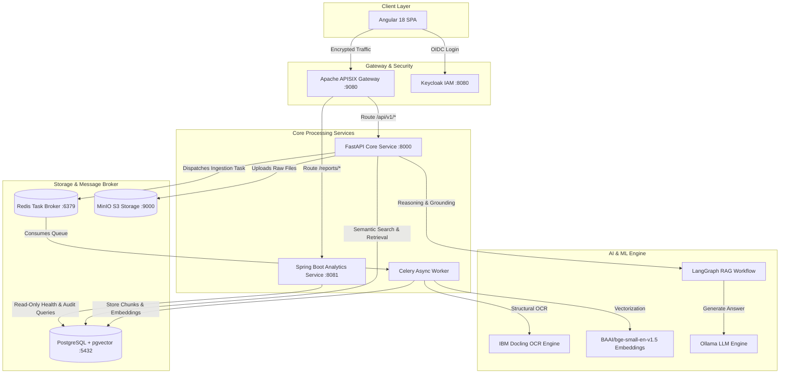

# 📄 DocIntelligence: Enterprise Document Intelligence & Hybrid RAG Platform

[](https://python.org)
[](https://fastapi.tiangolo.com)
[](https://angular.dev)
[](https://spring.io/projects/spring-boot)
[](https://docker.com)
[](https://github.com/pgvector/pgvector)
[](https://keycloak.org)
[](https://opensource.org/licenses/MIT)

**DocIntelligence** is a full-stack, distributed enterprise platform designed for deep document parsing, asynchronous OCR extraction, semantic vector retrieval, and context-grounded Retrieval-Augmented Generation (RAG). 

Built with a resilient microservices architecture, it pairs high-throughput asynchronous processing with enterprise-grade zero-trust authentication and operational health observability.

---

## 🏛️ System Architecture



---

## ✨ Key Features

### 1. 🧠 Structural Layout Extraction & OCR
* **Deep Parsing**: Powered by IBM Docling for structural layout detection, table extraction, and header-aware chunking on multi-page PDFs and scans.
* **Non-Blocking Architecture**: Document ingestion and OCR run entirely in background Celery workers, keeping the web API instantly responsive.

### 2. ⚡ Hybrid Vector Retrieval & LangGraph RAG
* **HNSW Vector Indexing**: High-dimensional text embeddings (`BAAI/bge-small-en-v1.5`) indexed via PostgreSQL `pgvector` with HNSW indices.
* **Isolated RAG Engine**: LangGraph orchestration with dedicated LLM abstraction. LLM query synthesis runs cleanly without triggering redundant OCR passes or locking documents.
* **Strict Grounding**: Synthesizes verified answers with direct passage citations and similarity scores.

### 3. 📊 Analytics & Health Microservice (Spring Boot 3 / Java 21)
* **Real-Time Health Metrics**: Aggregates document ingestion volumes, failure rates, and processing latency.
* **Stuck / Slow Pipeline Detection**: Identifies documents that exceed processing thresholds for proactive operations.
* **Audit & Activity Reporting**: Daily trend tracking and CSV export capabilities.

### 4. 🛡️ Zero-Trust Security & Identity
* **OAuth2 / OpenID Connect (OIDC)**: Centralized authentication powered by Keycloak with RS256 JWT validation.
* **Role-Based Access Control (RBAC)**: Fine-grained permissions separating standard `USER` operations from `ADMIN` reports and audits.

### 5. 🌐 Modern Angular 18 Web UI
* **Batch Document Ingestion**: Drag-and-drop uploading with instant client validation.
* **Live Processing Polling**: Real-time status tracking (`PENDING` ➔ `PROCESSING` ➔ `COMPLETED` / `FAILED`).
* **Semantic Search & Document Viewer**: Interactive chunk inspection, metadata viewing, and RAG Q&A chat.

---

## 📂 Repository Structure

```text
Doc-Intel/
├── app/                           # FastAPI Core Service
│   ├── api/                       # REST endpoints, dependencies, schemas
│   ├── domain/                    # Entities, models, and interfaces
│   ├── infrastructure/            # Celery, database (SQLAlchemy), OCR, RAG, MinIO
│   ├── services/                  # Business logic (Document, Search, RAG, Vector)
│   └── main.py                    # Application entry point
├── frontend/                      # Angular 18 Standalone Web UI
│   ├── src/app/core/              # Keycloak auth service, guards, API clients, stores
│   ├── src/app/features/          # Documents, Document Detail, Search, Dashboard, Reports
│   ├── nginx.conf                 # Production Nginx reverse proxy
│   └── Dockerfile                 # Multi-stage Angular build
├── reports/                       # Spring Boot 3 Analytics Microservice
│   ├── src/main/java/             # Security config, controllers, repositories, services
│   ├── pom.xml                    # Maven configuration
│   └── Dockerfile                 # Multi-stage Java 21 container
├── infra/                         # Gateway & IAM Configurations
│   ├── apisix/                    # Apache APISIX routes and configuration script
│   ├── keycloak/                  # Realm export definition
│   └── postgres/                  # Init SQL extensions (pgvector)
├── scripts/                       # Orchestration Scripts
│   ├── prod_up.sh / prod_up.ps1   # 1-Click production container launcher
│   ├── prod_down.sh / prod_down.ps1 # Clean production container teardown
│   ├── start_all.ps1              # Local dev launcher (host processes)
│   └── stop_all.ps1               # Local dev process terminator
├── docker-compose.prod.yml        # 11-Service production container orchestration
└── docker-compose.yml             # Local backing infrastructure compose
```

---

## 🚀 Quick Start Guide

### Prerequisites
* [Docker Desktop](https://www.docker.com/) (with Docker Compose v2)
* [Ollama](https://ollama.ai/) running locally (`ollama run gemma3:1b` or compatible model)

---

### Production Container Deployment (Recommended)

To build and start all 11 production containers with unified health checks:

**On Linux / macOS / Cloud VPS:**
```bash
chmod +x scripts/*.sh
./scripts/prod_up.sh
```

**On Windows (PowerShell):**
```powershell
.\scripts\prod_up.ps1
```

To gracefully stop the production stack:
```bash
./scripts/prod_down.sh      # Linux / macOS
.\scripts\prod_down.ps1    # Windows
```

---

### Local Development Mode

If you are developing locally with live code reload:

```powershell
.\scripts\start_all.ps1
```
This starts Docker backing infrastructure (Postgres, Redis, MinIO, Keycloak, APISIX) and launches 4 dedicated terminal windows for FastAPI, Celery, Spring Boot, and Angular.

---

## 🌐 Service Endpoints & Default Ports

| Service | Port | URL | Description |
| :--- | :--- | :--- | :--- |
| **Angular Web App** | `4200` | `http://localhost:4200` | Main frontend interface |
| **APISIX Ingress Gateway**| `9080` | `http://localhost:9080` | Unified API reverse proxy |
| **FastAPI Core API** | `8000` | `http://localhost:8000/docs` | Swagger interactive documentation |
| **Spring Boot Reports** | `8081` | `http://localhost:8081` | Reporting microservice |
| **Keycloak IAM** | `8080` | `http://localhost:8080` | Authentication & User management |
| **MinIO Console** | `9001` | `http://localhost:9001` | S3 Object storage web console |

---

## 🔒 Security & Environment Configuration

Copy the production template to initialize your local environment:
```bash
cp .env.prod.example .env.prod
```

> ⚠️ **Important**: In production, ensure all default passwords (`POSTGRES_PASSWORD`, `MINIO_SECRET_KEY`, `KEYCLOAK_ADMIN_PASSWORD`) are updated with cryptographically secure strings. Real `.env` and `.env.prod` files are strictly excluded from version control via `.gitignore`.

---

## 📄 License

This project is licensed under the MIT License — see the [LICENSE](LICENSE) file for details.
